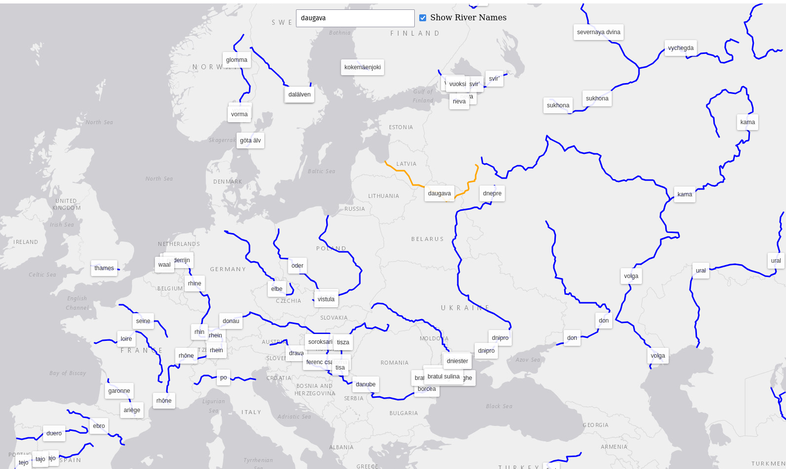

# 📜 My Course Work: Hydrological Dataset - Inland Rivers

This project visualizes the world's major rivers through an interactive map, allowing users to explore and search these waterways with ease.

# 📊 Data Set

Data source: [Natural Earh](https://github.com/martynafford/natural-earth-geojson)

### Responsible organization / producer

The data for this project originates from Natural Earth, a public domain project maintained by an international group of volunteers under the North American Cartographic Information Society (NACIS). In this project, I use a GeoJSON dataset of global rivers, converted from original ESRI shapefiles by martynafford.

### Characteristics

The provided GeoJSON data represents a FeatureCollection consisting of various geographical features with attributes and geometries describing each feature in detail.

Each river feature contains:

- Properties:
  - scalerank: A ranking scale of the feature’s significance.
  - featurecla: The classification of the feature.
  - name: The primary name of the feature.
  - note: Additional notes, if applicable.
  - min_zoom: The minimum zoom level for viewing.
  - name_alt: Alternative foreign names.
  - name_en: The English name of the feature.
  - min_label: Minimum zoom level for labeling.
- Geometry:
  - type: Type of geometry (typically “LineString” for rivers).
  - coordinates: Latitude and longitude coordinates defining the feature's path.

### Update cycle

This dataset is currently 7 years old, which is acceptable as river geography remains relatively static over time.

### Parameters - precision, accuracy

The dataset is simplified at a 1:50M scale, balancing detail and performance for global mapping applications. This level of detail is suitable for medium-zoom visualizations, providing a general but accurate overview of the world's major rivers.

### Licence

The data is in the public domain, allowing unrestricted use and sharing.
